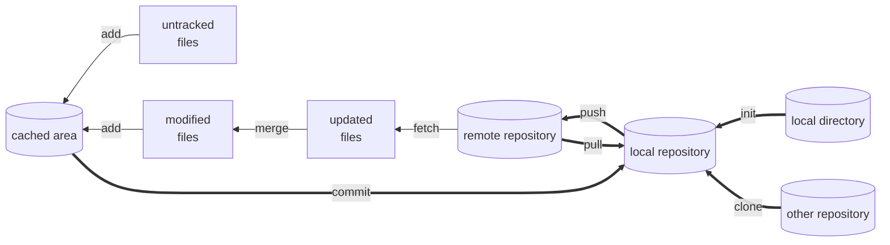
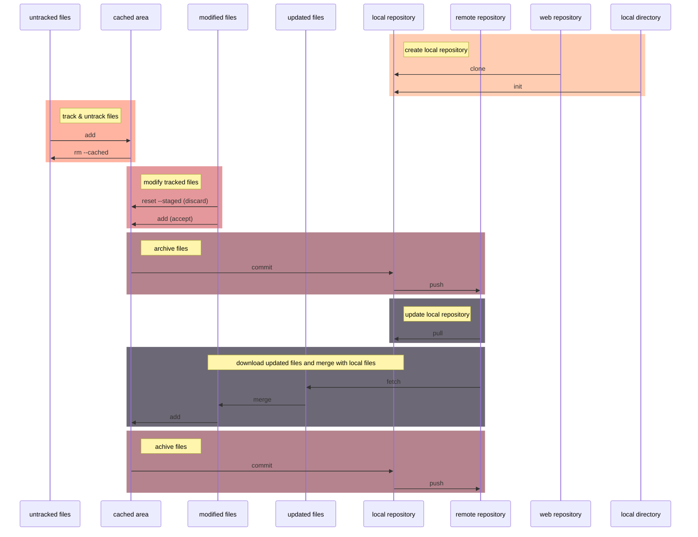

# Introduction

This is a quick reference for Git commands in **git & github**.

To get help in Git, type `git help <operation>` or `git <operation> --help` in command line

For more info in Git, visit [Pro Git](https://git-scm.com/book/en/v2) or [Github doc](https://docs.github.com/en).


# Install Git

Visit [Git download](https://git-scm.com/downloads) to get Git installation package.


# How to Use Git

For windows:
- **CMD or Powershell**
- **Git bash**
- Git GUI
- Third party software

The usage of **Git commands** in windows command line is the focus of this ref.

# Configure Git

There are three Git config files in different levels and different disk locations to configure Git. 
The configurations and options within installation process can be modified in config files. 
Three Git config files windows 10:

1. system config file works for the whole OS: 
    - \<git directory\>/ect/gitconfig
2. global config file works for the current login user:
    - \<user directory\>/.gitconfig
3. local config file works for the specific repository directory:
    - \<repository directory\>/.git/config

**The local config covers global config, and global config covers general config.**

For more info, type `git config --help`.

## List configurations 

Use the following command to display git configures. Add `--show-origin` option to display origin config file as well.

```
git config --list
```

## Set or unset variables

`git config --add <var>` set the variable in local config file where `--local` is optional. 

`git config --unset <var>` unset the variable in local config file. 

Add option *`--local`*, **`--global`**, or ***`--system`*** to operate in a specific level. 

Configure user name and email in global config file (usually used) with following command:

```
git config --global user.name "USER NAME"
git config --global user.email "MYEAMIAL@MINE.ME"
```

Additionally, the git config file can be edited with editor.

For all available configurations, type `git config --help` to view.


# Git Work Flow



<!--

-->


# Local Repository

## Check local repository status

To check the status of local git repository, use the following command.
```
git status
```

## Initialize a repository

### Initialize a local directory

To initialize a local working directory into a Git repository: 
```
cd <working_directory>
git init
```

### Clone an existing repository

To clone a existing repository from internet: 
```
git clone <repository_path> [<path>]
```
If \<path\> is not specified, 
a new working directory will be made with name of repository.


## Delete local repository

To delete a git local repository, directly delete `.git` directory by following commands or by
manual operations.
```
cd <target_directory>
rm -rf .git
```

## Ignore specific files

To ignore specific files while checking git status, add a file named `.gitignore` in local
repository directory.

For info about file ignorance method, check [github page](https://github.com/github/gitignore) 
or 
[Pro git](https://git-scm.com/book/en/v2/Git-Basics-Recording-Changes-to-the-Repository).


## Record files

### Add new files to cached area

To add current version of new files or modified files in the working directory to cached area, 
use the following command.
```
git add <file>
```


### Commit files to local repository

To commit files to local repository and save tracked files, use the following command.
```
git commit
```
After enter this command, a default editor will pop up and waits for a commit message.
Without a commit message, commit will fail.

To modify last commit (files or commit message):
```
git commit --amend
```


## Recover files

### Remove added files

To move the **file** from cached area to working directory, use the following command.
```
git rm --cached <file>
```


### Discard changes in working directory

The following commands will dicard changes of the file in working directory. 
Both commands will also reload the verison of the file in the search order of: 
1. **cached area**
2. **last commit**
```
git restore <modified_file>
```
OR
```
git checkout -- <file>
```


### Discard changes in cached area

The following commands will move **changes** of the file from cached area to working directory. 
```
git restore --staged <modified_file>
```
OR
```
git reset HEAD <file>
```

## Compare files

To display changes between working directory and the last commit:
```
git diff
```

To display changes between cached area and the last commit:
```
git diff --cached
```


## Remove files

To remove a committed file from next commit and working directory:
```
git rm <file>
```

The above command equals to
```
rm <file>
git add <file>
```


## Clean
To view results of clean:
```
git clean --dry-run
```
which is same as option `-n`.

To clean untracked files which are not ignored:
```
git clean
```
with option `-i` to run interactively, 
with option `-x` to clean Git produced files which are ignored by default, 
with option `-X` to clean files ignored by Git


# Submodule

## Add submodule
To add a repository into current local repository as submodule:
```
git submodule add <repository_path> [<path>]
```
If \<path\> is not specified, 
the repository will be added to a new directory named the same as the repository.

After adding a submodule, a `.gitmodules` file will be added.


## Unregister submodule
To unregister a submodule:
```
git submodule deinit <submodule>
```


## View submodule difference
To view submodule differences add the option `--submodule` in `git diff` command.


## Clone or pull a repository with submodule
After cloning a repository or pulling a reposiroty with submodule, 
use the following commands to clone the submodule repository: 
```
git submodule init
git submodule update
```
Or
```
git submodule update --init
```
Add option `--init` for pulling is safe for new committed submodules to be  pulled.
The option `--recurese-submodule` to update nested submodules.

To clone a repository with its submodules at the same time: 
```
git clone --recurese-submodule <repository_path> [<path>]
```


## Update submodule
Submodules can be updated by Git commands in the submodule directory. Or use the following command to updated with the default branch:
```
git submodule update --remote
```


## Push repository with submodules
To safely push repositroy with submodules:
```
git push --recurse-submodule=check
```


## More info
For more info about git submodule, check
[submodule](https://git-scm.com/book/en/v2/Git-Tools-Submodules).


# Commit management

## View commit history

To view commit history:
```
git log
```

To change the message of each commit:
|Option             |Description                                    |
|:---               |:---                                           |
|`--graph`          |show branch history with graphic description   |
|`-p`               |show differences introduced by each commit     |
|`--shortstat`      |show abbreviated stats for each commit         |
|`--stat`           |shorten `--stat` infos                         |
|`--name-only`      |show names of changed files                    |
|`--name-status`    |show changes of changed files                  |
|`--pretty`         |show commits with alternate format             |

To limit number of commit to be printed, use following options:
|Option                     |Description                                        |
|:---                       |:---                                               |
|`--all`                    |show all branches and commits                      |
|`-[N]`                     |only last N commits                                |
|`--since` or `--after`     |only commits after the specific date               |
|`--until` or `--before`    |only commits before the specific date              |
|`--grep`                   |only commits with messages containing the string   |
|`-S`                       |only commits changing code matching the string     |
|`--author`                 |only commits with matched author                   |
|`committer`                |only commits with matched committer                |


## View branches
To view local branches:
```
git branch
```

To view branches and corresponding last commits:
```
git branch -v
```

To view merged or unmerged branches add option `--merged` or `--no-merged`.


## Branch modifications
To create a new branch:
```
git branch <branch>
```

To rename the current branch:
```
git branch -m <new_branch_name>
```

To delete a branch:
```
git branch -d <branch>
```
Replace `-d` with `-D` to forcibly delete a branch which hasn't been merge to other branch.


## Checkout branches
To checkout an existing branch (move `HEAD` pointer to another branch):
```
git checkout <branch>
```

To create a new branch and checkout it immediately:
```
git checkout -b <branch>
```


## Merge branches
To merge current branch and target branch:
```
git merge <branch>
```

If the commit of the target branch is directly ahead of the commit of the current branch, the pointer of current branch will be move forward.

If the two branch diverged from older point, there will be a new commit merged by the current branch and the target branch.

If there are conflicts between two branch, the git will give a hint. 
The confilct should be resolved by modify the confilct files.

The confilct contents of different branches are marked by:
```
<<<<<<< <branch>:<file>
<content>
```
and divided by:
```
=======
```

Or use the interactive tool to handle merge conflicts:
```
git mergetool
```


## Stash current changes
To temporarily save current cached area and working directory for later recovery:
```
git stash [push]
```
After this command, the cached area and working directory will be clean as last commit.
To stash cached area and not clean cached area add option `--keep-index`.
To stash untracked files add option `-u` or `--include-untracked`, 
and `-a` or `--all` to stash ignored files as well.

To view stash list:
```
git stash list
```

To load a specific stash:
```
git stash apply [<stash>]
```
If \<stash\> is not given, the last stash will be loaded.

To remove a specific stash from stash list:
```
git stash drop [<stash>]
```

To load a stash and remove it from stash list:
```
git stash pop [<stash>]
```

To cerate a bew branch based on current modified cahced area and working directory:
```
git stash branch <branch> [<stash>]
```


## Rebase
To rebase current branch to a base branch:
```
git rebase <base_branch>
```
After this command, conflicts between commits need manual resolution with:
```
git add <conflict_file>
git rabase --continue
```

To abort reabse operation:
```
git rebase --abort
```

To rebase with more interactive options:
```
git rebase -i <base_branch>
```
`edit` cloud be used to modify commit messages.
`squash` could be used to compress commits.


## Reset
To reset commit (move current branch to previous commit),
but remain cached area and working directory of current commit:
```
git reset --soft <commit>
```

To reset commit and cached area, 
but remain current working directory of current commit:
```
git reset [--mixed] <commit>
```

To reset commit, cached area, and working directory:
```
git reset --hard <commit>
```
***This command is dangerous, which will lose the commits after the \<commit\>.***
To undo this command, `reflog` is needed.


# Remote Repository

## View remote path

To view aliases of remote repositories configured for local repository:
```
git remote
```

To display remote repositories and associated URLs:
```
git remote -v
```

To view details of a remote repository:
```
git remote show <remote>
```


## Modify remote repository configs

To add a remote repository:
```
git remote add <remote> <url>
```

To rename a remote repository:
```
git remote rename <old_name> <new_name>
```

To change the URL of a remote repository:
```
git remote set-url <remote> <new_url>
```

To remove a remote repository:
```
git remote remove <remote>
```


## View remote branches
To view remote branches of all remote repositories:
```
git branch -r
```

To view remote branches' tracking information:
```
git branch -vv
```


## Update remote branch info
To update records of remote branches:
```
git remote update -p
```


## Push
To push current branch to default remote branch:
```
git push
```
To force current branch to cover remote branch, add option `-f` or `--force`.
`rebase` or `commit --amend` might need this option.
***Push forcibly with CAUTION.***

To specify branches and remote repository:
```
git push <remote> [<local_branch>[:<remote_branch>]]
```

To push current branch and add upstream reference:
```
git push -u <remote> [<local_branch>[:<remote_branch>]]
```

To push all local branches:
```
git push --all
```


## Fetch
To download commits from remote repository:
```
git fetch
```
To specify remote repository:
```
git fetch <remote> <remote_branch>
```

After fetch commits, manual merge is needed.


## Pull
To pull current branch from default remote branch:
```
git pull
```
which can be seemed as:
```
git fetch
git merge
```
To specify branches and remote repository:
```
git pull <remote> [<remote_branch>]
```
To pull all remotes:
```
git pull --all
```


## Checkout remote branch
To copy a remote branch and checkout it:
```
git checkout -t <remote>/<remote_branch>
```
If the remote branch can't be found, try ***update remote branch info***.


## Track branch
Automatically, cloned branches and pushed branches 
are tracked with corresponing remote branches.

To manually set a remote upstream branch for current branch of local repository:
```
git branch -u <remote>/<remote_branch>
```
If the remote branch can't be found, try ***update remote branch info***.


## Delete remote branch
To delete specific remote branch:
```
git push <remote> --delete <remote_branch>
```


## Set remote HEAD pointer
To manual set remote HEAD pointer:
```
git remote set-head <remote> <branch>
```


# Tagging
One commit can hold multiple tags.
No repeative tags are allowed.


## Local tagging
To view existing tags:
```
git tag
```

To list existing tags with match string, where `-l` is as the same as `-list`: 
```
git tag -l <string>
```

To add a tag to specific commit: 
```
git tag <tag> <commit>
```
If \<commit\> is not given, the target commit is the last commit.

To add a tag and annotations to specific commit:
```
git tag -a <tag> <commit>
```
If \<commit\> is not given, the target commit is the last commit.
After execute the above command, the editor will pop up for annotating.

To delete a tag:
```
git tag -d <tag>
```


## Remote tagging
To share local a specific tag to remote repository:
```
git push <remote> <tag>
```

To share all local tags to remote repository:
```
git push <remote> --tags
```

To delete a specific tag from remote repository:
```
git push <remote> --delete <tag>
```


