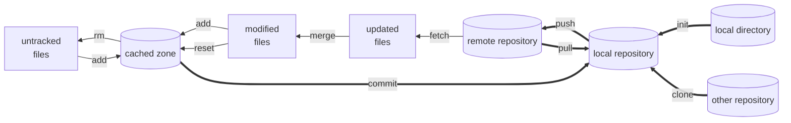

# Introduction

This is a quick reference for Git commands in **git & github**.

To get help in Git, type `git help <operation>` or `git <operation> --help` in command line

For more info in Git, visit [Pro Git](https://git-scm.com/book/en/v2) or [Github doc](https://docs.github.com/en).


# Install Git

Visit [Git download](https://git-scm.com/downloads) to get Git installation package.


# How to Use Git

For windows:
- **CMD or Powershell**
- **Git bash**
- Git GUI
- Third party software

The usage of **Git commands** in windows command line is the focus of this ref.

# Configure Git

There are three Git config files in different levels and different disk locations to configure Git. 
The configurations and options within installation process can be modified in config files. 
Three Git config files windows 10:

1. system config file works for the whole OS: 
    - \<git directory\>/ect/gitconfig
2. global config file works for the current login user:
    - \<user directory\>/.gitconfig
3. local config file works for the specific repository directory:
    - \<repository directory\>/.git/config

**The local config covers global config, and global config covers general config.**

For more info, type `git config --help`.

## List configurations 

Use the following command to display git configures. Add `--show-origin` option to display origin config file as well.

```
git config --list
```

## Set or unset variables

`git config --add <var_name>` set the variable in local config file where `--add` is optional. 

`git config --unset <var_name>` unset the variable in local config file. 

Add option *`--local`*, **`--global`**, or ***`--system`*** to operate in a specific level. 

Configure user name and email in global config file (usually used) with following command:

```
git config --global user.name "USER NAME"
git config --global user.email "MYEAMIAL@MINE.ME"
```

Additionally, the git config file can be edited with editor.

For all available configurations, type `git config --help` to view.


# Git Work Flow




# Frequently Used Git Repository Operation Commands

## Initialize a repository

User could create a loacl Git repository by:
- initialize a local directory
- clone an existing repository

### Initialize a local directory

The following commands initialize a local existing directory to a Git repository.
```
cd <target_directory>
git init
```

### Clone an existing repository

The fllowing commands clone a existing repository from internet or another local path to current directory and make a new directory.
```
git clone <repository_path>
```

