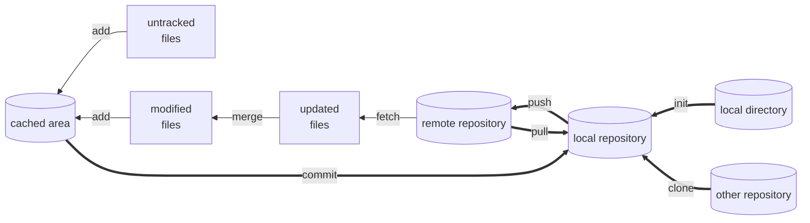
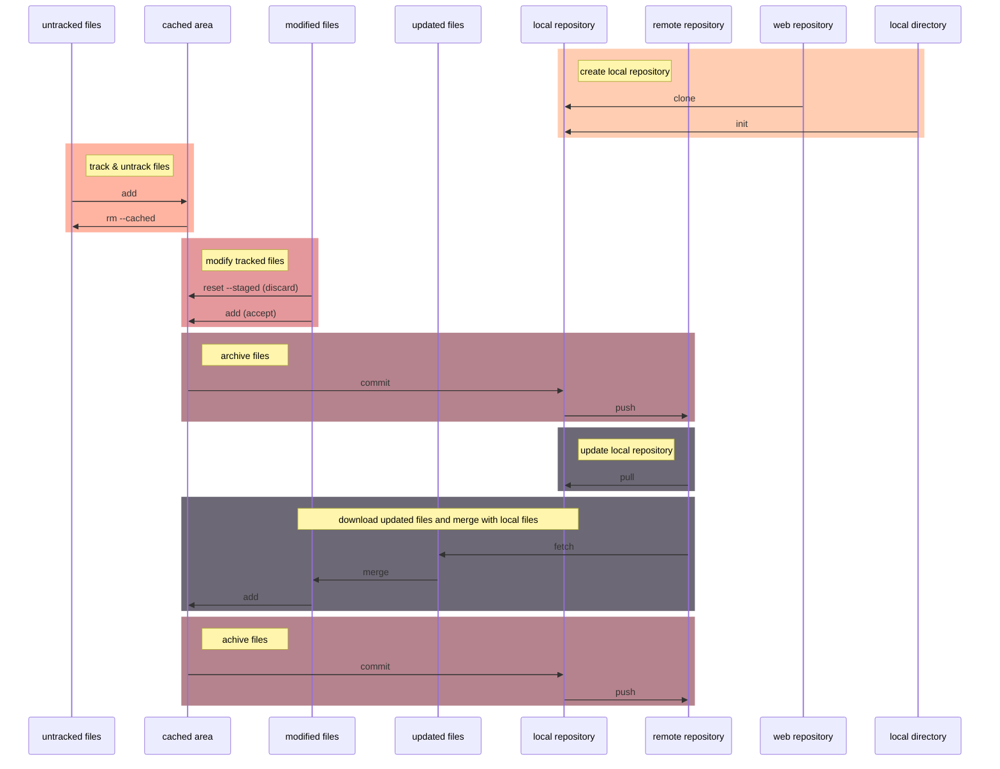

# Introduction

This is a quick reference for Git commands in **git & github**.

To get help in Git, type `git help <operation>` or `git <operation> --help` in command line

For more info in Git, visit [Pro Git](https://git-scm.com/book/en/v2) or [Github doc](https://docs.github.com/en).


# Install Git

Visit [Git download](https://git-scm.com/downloads) to get Git installation package.


# How to Use Git

For windows:
- **CMD or Powershell**
- **Git bash**
- Git GUI
- Third party software

The usage of **Git commands** in windows command line is the focus of this ref.

# Configure Git

There are three Git config files in different levels and different disk locations to configure Git. 
The configurations and options within installation process can be modified in config files. 
Three Git config files windows 10:

1. system config file works for the whole OS: 
    - \<git directory\>/ect/gitconfig
2. global config file works for the current login user:
    - \<user directory\>/.gitconfig
3. local config file works for the specific repository directory:
    - \<repository directory\>/.git/config

**The local config covers global config, and global config covers general config.**

For more info, type `git config --help`.

## List configurations 

Use the following command to display git configures. Add `--show-origin` option to display origin config file as well.

```
git config --list
```

## Set or unset variables

`git config --add <var_name>` set the variable in local config file where `--add` is optional. 

`git config --unset <var_name>` unset the variable in local config file. 

Add option *`--local`*, **`--global`**, or ***`--system`*** to operate in a specific level. 

Configure user name and email in global config file (usually used) with following command:

```
git config --global user.name "USER NAME"
git config --global user.email "MYEAMIAL@MINE.ME"
```

Additionally, the git config file can be edited with editor.

For all available configurations, type `git config --help` to view.


# Git Work Flow



<!--

-->


# Local Repository

## Check loacl repository status

To check the status of local git repository, use the following command.
```
git status
```

## Initialize a repository

### Initialize a local directory

The following commands initialize a local working directory into a Git repository.
```
cd <working_directory>
git init
```

### Clone an existing repository

The fllowing command clone a existing repository 
from the internet or a local path 
and make a new working directory named by the repository.
```
git clone <repository_path>
```

## Delete local repository

To delete a git local repository, directly delete `.git` directory by following commands or by
manual operations.
```
cd <target_directory>
rm -rf .git
```

## Ignore specific files

To ignore specific files while checking git status, add a file named `.gitignore` in local
repository directory.

For info about file ignorance method, check [github page](https://github.com/github/gitignore) 
or 
[Pro git](https://git-scm.com/book/en/v2/Git-Basics-Recording-Changes-to-the-Repository).


## Record files

### Add new files to cached area

To add current version of new files or modified files in the working directory to cached area, 
use the following command.
```
git add <file_path>
```


### Commit files to local repository

To commit files to local repository and save tracked files, use the following command.
```
git commit
```
After enter this command, a default editor will pop up and waits for a commit message.
Without a commit message, commit will fail.


## Recover files

### Remove added files

To move the **file** from cached area to working directory, use the following command.
```
git rm --cached <file_path>
```


### Discard changes in working directory

The following command will dicard changes of the file in working directory. 
This command will also reload the verison of the file in the search order of: 
1. **cached area**
2. **last commit**
```
git restore <modified_file_path>
```


### Discard changes in cached area

The following command will move **changes** of the file from cached area to working directory. 
```
git restore --staged <modified_file_path>
```


## Compare files

To display changes between working directory and the last commit:
```
git diff
```

To display changes between cached area and the last commit:
```
git diff --cached
```


## Remove files


# Commit management

## Check commit history

To display commit history:
```
git log
```

## Create new branch

```
git branch <branch_name>
```

## Checkout 

```
git checkout <branch_name>
```


# Remote Repository

## Check remote path

To display remote repositories configured for local repository:
```
git remote
```

TO display remote repositories and associated URLs:
```
git remote -v
```

## Add remote link

To add a remote repository:
```
git remote add <name> <URL>
```
where \<name\> is a alias to the URL defined by user, such as "origin". 


## Push


## Fetch


## Pull


