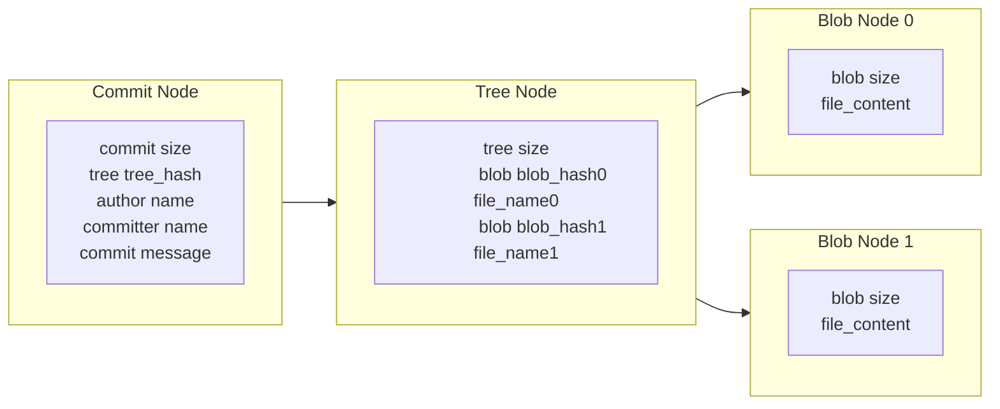
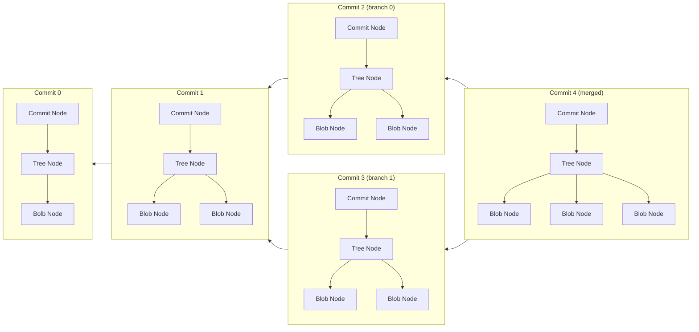

# Introduction

This is a quick reference for Git commands in **git & github**.

To get help in Git, type `git help <operation>` or `git <operation> --help` in command line

For more info in Git, visit [Pro Git](https://git-scm.com/book/en/v2) or [Github doc](https://docs.github.com/en).


# Install Git

Visit [Git download](https://git-scm.com/downloads) to get Git installation package.


# How to Use Git

For windows:
- **CMD or Powershell**
- **Git bash**
- Git GUI
- Third party software

The usage of **Git commands** in windows command line is the focus of this ref.


# Configure Git

There are three Git config files in different levels and different disk locations to configure Git.
The configurations and options made during installation process can be modified in config files.

Three Git config files windows 10:

1. system config file works for all login users of the OS:
    - \<git directory\>/ect/gitconfig
2. global config file works for the current login user:
    - \<user directory\>/.gitconfig
3. local config file works for the specific repository:
    - \<repository directory\>/.git/config

**The local config covers the global config, and the global config covers the system config.**

For more info, type `git config --help`.


## List configurations

To view git configures:

```
git config --list
```
Add option `--show-origin` to display origin config file as well.


## Modify configurations

To add a new configuration or modify an existing configuration:
```
git config [--local | --global | --system] <var> <value>
```
Use option **`--local`**, **`--global`**, or **`--system`**
to create or modify the configuration in the specific config file.

If range is not given,
the configuration in the local config file will be set.

To forcibly add a new configuration:
```
git config --add [--local | --global | --system] <var> <value>
```
If the configuration is existing,
a same configuration will be added.

To delete a configuration:
```
git config --unset [--local | --global | --system] <var>
```

To configure user name and email in global config file (usually used):
```
git config --global user.name "USER NAME"
git config --global user.email "MYEAMIAL@MINE.ME"
```

To configure gvim as default editor for git:
```
git config --global core.editor "'<gvim_path>\gvim.exe' --nofork '%*'"
```

To open an editor to modify git configurations:
```
git config [--local | --global | --system] -e
```
Additionally, the git config file can be by editor out of git.

For all available configurations, type `git config --help` to view.


# Git Work Flow

## From perspective of area


## From perspective of file


## From perspective of node connections




## From perspective of commit




# Create a Git Repository

## From a local directory

To initialize a local directory into a git repository:
```
cd <local_directory>
git init
```


## From an existing repository

To clone an existing repository from the internet or a local path:
```
git clone [-b <branch>] [--] <repository_path> [<path>]
```
If `-b <branch>` is not given,
the default branch will be cloned.

If `<path>` is not given,
a new working directory will be created to hold the repository.
The new directory will be named as the same as the repository.


## Check git repository status

To check the status of git repository:
```
git status
```
**This is the most often used command.**


## Delete local repository

To delete a git repository from local disk:
```
cd <target_directory>
rm -rf .git
```
or directly delete `.git` directory by manual operations.


## Ignore specific files

To ignore specific files during checking git status,
add a file named `.gitignore` in local repository directory.
The `.gitignore` file specifies which files are intended to be ignored.

For more info about file ignorance, check
[Pro git](https://git-scm.com/book/en/v2/Git-Basics-Recording-Changes-to-the-Repository).
or
[github page](https://github.com/github/gitignore)


# Make a Commit

## Add new files to staging area

To add current untracked files or modified files from working directory to staging area:
```
git add [<option>] [--] <path>
```

The option `-p` is used to choose which modifications to be added.
The option `-i` is used to interactively add files.


## Commit files to local repository

To commit files from staging area to local repository and archive:
```
git commit
```

After execution of this command,
a default editor will pop up and waits for a commit message being entered.
The commit will fail without a commit message.

To modify last commit (files or commit message):
```
git commit --amend
```
The command won't create a new commit.
However, if the last commit has been **pushed** to remote,
there will be a new commit generated.


# Recover Files

## Untrack files

To move **files** from staging area to working directory, use the following command.
```
git rm --cached [--] <path>
```


## Discard changes in working directory

To discard **changes** of the files in working directory:
```
git restore [--] <path>
```
or
```
git checkout [--] <path>
```
Both commands will reload the cached or archived verison of the files in the search order of:
1. **staging area**
2. **last commit**

The files will still be tracked by git after these commands.


## Discard changes in staging area

To move **changes** of the files from staging area to working directory:
```
git restore --staged [--] <path>
```
or
```
git reset HEAD [--] <path>
```
The files will still be tracked by git after these commands.


# Remove Files

To remove committed files from next commit and working directory:
```
git rm [--] <path>
```

The above command equals to
```
rm <file>
git add <file>
```


# Compare Differences

## View within command line

The normal output format of `git diff`:
```
diff --git a/<file_a> b/<file_b>
index <index_hash_of_file_a>..<index_hash_of_file_b> <filetype&authority>
--- a/<file_a>
+++ b/<file_b>
@@ -<start_line_number>,<total_number_of_lines> +<start_line_number>,<total_number_of_lines> @@
 <same_content>
+<unique_content_in_file_b>
 <same_content>
 <same_content>
-<unique_content_in_file_a>
 <same_content>
-<unique_content_in_file_a>
-<unique_content_in_file_a>
+<unique_content_in_file_b>
```

To view differences of a file between specific commit and current working directory:
```
git diff [<commit>] [--] [<path>]
```
where the file in the commit will be marked as `a`,
the file in the working directory as `b`.

If the `<commit>` is not given,
and there is a staged version of the file,
the file in staging area will be compared.
Otherwise, the file in the last commit will be compared.

If a directory or a file path as `[--] <path>` is not given,
all files will be compared.

To view differences of a file between the `<commit>` and staging area:
```
git diff --cached [<commit>] [--] [<path>]
```
where the file in the `<commit>` or the last commit will be marked as `a`,
and the file in staging area will be marked as `b`.

To view differences of a file between two commits:
```
git diff <commit_a> <commit_b> [--] [path]
```
where the file on `<commit_a>` will be marked as `a`,
and the file in `<commit_b>` will be marked as `b`.

To view differences of a file between common ancestor of commits and `<commit_b>`:
```
git diff --merge-base <commit_a> [<commit_b>] [--] [<path>]
```
If only `<commit_a>` is given,
the differences between common ancestor of `<commit>` and HEAD will be displayed.


## View with editor tool

To view differences in an editor:
```
git difftool [-t=<tool>] <...>
```
where `<...>` are options like `git diff`.

If the `[-t=<tool>]` is not given,
the default editor will be launched.

To view available tools:
```
git difftool --tool-help
```


# Clean Redundant Files

To simulate a clean operation:
```
git clean --dry-run
```
`--dry-run` is identical to the option `-n`.

To clean untracked files which are not ignored:
```
git clean
```
with option `-i` to run interactively,
with option `-x` to clean Git produced files which are ignored by default,
with option `-X` to clean files ignored by Git


# Commit Management

## View commit history

To view commit history:
```
git log [<option>] [<commit_range>] [[--] [<file_path>]]
```

To change the message of each commit:
|Option             |Description                                    |
|:---               |:---                                           |
|`--graph`          |show branch history with graphic description   |
|`-p`               |show differences introduced by each commit     |
|`--shortstat`      |show abbreviated stats for each commit         |
|`--stat`           |shorten `--stat` infos                         |
|`--name-only`      |show names of changed files                    |
|`--name-status`    |show changes of changed files                  |
|`--pretty`         |show commits with alternate format             |

The `--graph` and `p` are useful for overview and file content insertion locaiton respectively.

To limit number of commit to be printed, use following options:
|Option                     |Description                                        |
|:---                       |:---                                               |
|`--all`                    |show all branches and commits                      |
|`-<N>`                     |only last N commits                                |
|`--first-parent`           |only show the first parent commits                 |
|`-g`                       |view commits by time order                         |
|`--since` or `--after`     |only commits after the specific date               |
|`--until` or `--before`    |only commits before the specific date              |
|`--grep`                   |only commits with messages containing the string   |
|`-S`                       |only commits changing code matching the string     |
|`--author`                 |only commits with matched author                   |
|`committer`                |only commits with matched committer                |

The `--all`, `-<N>`, and `--first-parent` are useful for commit history view.
The `-g` is important for lost commit finding.


## Commit indexing

|Method                     |Which Commit                   |
|:---                       |:---                           |
|`<branch>`                 |last commit of `<branch>`      |
|`<hash_value>`             |specific commit                |
|`<partial_head_of_hash>`   |most matched commit            |
|`HEAD`                     |where HEAD is pointed at       |
|`HEAD^` or `HEAD~`         |previous commit of HEAD        |
|`HEAD^<N>` or `HEAD~<N>`   |the previous N commit of HEAD  |


## Show details of commit

To show details of a commit:
```
git show <commit>
```
If `<commit>` is not given,
details of the HEAD commit will be displayed


## View branches

To view local branches:
```
git branch
```

To view branches and corresponding last commits:
```
git branch -v
```

To view merged or unmerged branches add option `--merged` or `--no-merged`.


## Branch operations

To create a new branch:
```
git branch <branch>
```

To rename the current branch:
```
git branch -m <new_branch_name>
```

To delete a branch:
```
git branch -d <branch>
```
Replace `-d` with `-D` to forcibly delete a branch which hasn't been merge to other branches.


## Checkout branches

To checkout an existing branch (move `HEAD` pointer to the branch,
and start to work on the branch):
```
git checkout <branch>
```

To create a new branch and checkout it immediately:
```
git checkout -b <branch>
```


## Merge branches

To merge current branch **with (not to)** target branch:
```
git merge [--no-ff] <target_branch>
```

By default, if the last commit of the target branch is directly ahead of the commit of the current branch,
the pointer of current branch will be move forward (fast-forward mode).

If the two branch diverged from an older point,
there will be a new commit merged by the current branch and the target branch.

With `--no-ff`, create a merge commit in all cases.

During a merge, among changes from different sides made to the common ancestor,
**changes made to different areas** in sides will be incorporated in the final result.
When both sides **made changes to the same area**, Git will report a confilct.

The confilct texts of files from different branches are marked by:
```
<<<<<<< <branch>:<file>
<content>
```
and
```
<content>
>>>>>>> <branch>:<file>
```
and divided by:
```
=======
```

To abort merge operation:
```
git merge --abort
```

For more info about merge, check
[advanced merging](https://git-scm.com/book/en/v2/Git-Tools-Advanced-Merging)

To use the interactive tool to handle merge conflicts:
```
git mergetool [-t=<tool>]
```
If the `-t=<editor>` is not given,
the default tool will be launched.

For vim, the layout is explained and changed as shown in
[vimdiff](https://git-scm.com/docs/vimdiff/en)

To view available tools:
```
git mergetool --tool-help
```


## Stash current changes

To temporarily save current staging area and working directory for later recovery:
```
git stash [push]
```
After this command,
the staging area and working directory will be the same as the last commit.
To stash staging area and not clean staging area add option `--keep-index`.
To stash untracked files add option `-u` or `--include-untracked`,
and `-a` or `--all` to stash ignored files as well.

To view stash list:
```
git stash list
```

To load a specific stash:
```
git stash apply [--index] [<stash>]
```
If `<stash>` is not given, the last stash will be loaded.
**The `<stash>` in powershell should be embraced by single quotation marks.**

Option `--index` is recommended.
**Without `--index` the unstaged changes of tracked files will be staged automatically after `stash apply`.**

To remove a specific stash from stash list:
```
git stash drop [<stash>]
```

To load a stash and remove it from stash list:
```
git stash pop [<stash>]
```

To cerate a bew branch based on current modified cahced area and working directory:
```
git stash branch <branch> [<stash>]
```


## Rebase

To rebase current branch **to (not with)** a base branch:
```
git rebase <base_branch>
```
After this command,
conflicts between commits need manual resolution and:
```
git add <conflict_file>
git rabase --continue
```

To abort reabse operation:
```
git rebase --abort
```

To rebase with more interactive options:
```
git rebase -i <base_branch>
```
where multiple options are available.
`edit` cloud be used to modify commit messages.
`squash` could be used to compress commits.


## Reset

To reset commit (move current branch to previous commit),
but **remain current staging area and working directory**:
```
git reset --soft <commit>
```

To reset commit and staging area,
but **remain current working directory**:
```
git reset [--mixed] <commit>
```

To reset commit, staging area, and working directory:
```
git reset --hard <commit>
```
***This command is dangerous,
which will lose the commits after the `<commit>`.***
To undo this command, `reflog` is needed.
For more info, check
[git reflog](https://git-scm.com/search/results?search=git-reflog).


# Remote Repository

## Set a ssh connection to github

Check [github authentication with ssh](https://docs.github.com/en/authentication/connecting-to-github-with-ssh/about-ssh).


## View remote repositories

To view name of remote repositories configured for local git repository:
```
git remote
```

To display remote repositories and associated URLs:
```
git remote -v
```

To view details of a remote repository:
```
git remote show <remote>
```


## Modify remote repository configs

To add a remote repository:
```
git remote add <remote> <url>
```

To rename a remote repository in local remote list:
```
git remote rename <old_name> <new_name>
```

To change the URL of a remote repository:
```
git remote set-url <remote> <new_url>
```

To remove a remote repository:
```
git remote remove <remote>
```


## Update remote info

To update commits of remote branches:
```
git remote update [<branch>]
```
If `[<branch>]` is not given,
all branches will be updated.
This command is similar to `git fetch`.

To prune branches of specific remote:
```
git remote prune [--dry-run | -n] <remote>
```
Prune remote-tracking branches under `<remote>` are deleted.
It's equivalent to `git fetch --prune <remote>`.


## View remote branches

To show remote branch information:
```
git remote show <remote>
```

To view remote branches of all remote repositories with local record:
```
git branch -r
```

To view remote branches' tracking information with local record:
```
git branch -vv
```


## Track and untrack branch

Automatically, cloned branches and pushed branches
are tracked with corresponding remote branches.

To manually set a remote upstream branch for current branch:
```
git branch -u <remote>/<remote_branch>
```
If the remote branch can't be found, try ***update remote branch info*** above.

To manually unset a remote upstream branch for current branch:
```
git branch --unset-upstream [<local_branch>]
```
If `[<local_branch>]` is not givin,
the upstream of current branch will be unset.


## Push

To push current branch to default remote branch:
```
git push
```
To force current branch to cover remote branch, add option `-f` or `--force`.
Operations like `rebase` or `commit --amend` in local git repository might need this option
to update to remote.

***Push forcibly with CAUTION.***
Because this is difficult to reverse in remote repository.

To specify branches and remote repository:
```
git push <remote> [<local_branch>[:<remote_branch>]]
```
add option `-u` to add upstream reference,
which will make `<local_branch>` to track `<remote_branch>`.

To push all local branches:
```
git push --all
```


## Fetch

`fetch` is similar to `remote update`.

To update all remote repositories information and download all commits from remote repositories:
```
git fetch --all
```

To specify remote repository:
```
git fetch [<remote>] [<remote_branch>]
```
The current branch from `origin` the remote repository will be used by defualt,
unless there's an upstream branch for current branch.

After fetch new commits, manual merge is needed.


## Pull

To pull current branch from default remote branch:
```
git pull
```
which can be seemed as:
```
git fetch
git merge
```

To specify branches and remote repository:
```
git pull <remote> [<remote_branch>]
```

To pull all remotes:
```
git pull --all
```


## Checkout remote branch

To copy a remote branch and checkout it:
```
git checkout -t <remote>/<remote_branch>
```
If the remote branch can't be found, try ***update remote branch info*** above.


## Delete remote branch

To delete specific remote branch:
```
git push <remote> --delete <remote_branch>
```


## Set remote HEAD pointer

To manual set remote HEAD pointer:
```
git remote set-head <remote> <branch>
```


# Submodule

## Add submodule

To add a repository into current local repository as submodule:
```
git submodule add <repository_path> [<path>]
```
If `<path>` is not specified,
the repository will be added to a new directory named the same as the repository.

After adding a submodule, a `.gitmodules` file will be added,
which records the submodule information.


## Unregister submodule

To unregister a submodule:
```
git submodule deinit <submodule>
```


## View submodule difference

To view submodule differences add the option `--submodule` in `git diff` command.


## Clone or pull a repository with submodule

After cloning a repository or pulling a reposiroty with submodule,
use the following commands to clone the submodule repository:
```
git submodule init
git submodule update
```
Or
```
git submodule update --init
```
Add option `--init` for pulling is safe for new committed submodules to be pulled.
The option `--recursive` to update nested submodules.

To clone a repository with its submodules at the same time:
```
git clone --recures-submodule <repository_path> [<path>]
```

***If the access to remote repository of submodule is denied,
try it in git bash. ***


## Update submodule

Submodules can be updated by Git commands in the submodule directory.
Or use the following command to updated with the default branch:
```
git submodule update --remote [--merge | rebase] -- [<path>]
```
If `--merge` or `--rebase` is not given,
the HEAD pointer will be detached.
Manual merge and rebase in submodule can fix this problem.


## Push repository with submodules

To safely push repositroy with submodules:
```
git push [--recurse-submodule=check]
```
The option `--recurse-submodule=check` checks whether the submodules has been pushed to remote.


## Submodule iteration

To iteratively execute commands in submodules:
```
git submodule foreach '<git_command>'
```


## More info

For more info about git submodule, check
[submodule](https://git-scm.com/book/en/v2/Git-Tools-Submodules).


# Tagging

One commit can have multiple tags.
Tags should have unique names.


## Local tagging

To view existing tags:
```
git tag
```

To list existing tags with match string,
where `-l` is as the same as `-list`:
```
git tag -l <string>
```

To add a tag to specific commit:
```
git tag <tag> <commit>
```
If `<commit>` is not given,
the target commit is the last commit.

To add a tag and annotations to specific commit:
```
git tag -a <tag> <commit>
```
If `<commit>` is not given,
the target commit is the last commit.
After execute the above command,
an editor will pop up for annotating.

To show tag and annotations:
```
git show <tag>
```

To delete a tag:
```
git tag -d <tag>
```


## Remote tagging

To share a local tag to remote repository:
```
git push <remote> <tag>
```

To share all local tags to remote repository:
```
git push <remote> --tags
```

To delete a tag from remote repository:
```
git push <remote> --delete <tag>
```


# Other Git Functions

- Search
- Replace
- Bundle
- Signiture
- Certification Management
- ...


