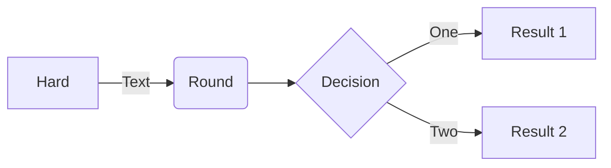

# Introduction

This is a quick reference for markdown syntax in **github & vim**.

For more info about markdown in github, visit [markdown docs](https://docs.github.com/zh/get-started/writing-on-github/getting-started-with-writing-and-formatting-on-github/quickstart-for-writing-on-github)

For more info about markdown in vim, visit [markdown-preview.nvim](https://github.com/iamcco/markdown-preview.nvim)


# Heading

There are 6 header levles as following:

# Heading level 1

## Heading level 2

### Heading level 3

#### Heading level 4

##### Heading level 5

###### Heading level 6


# Paragraph Break

Use a blank line to break two paragraphs. 


# Comment

Texts between `<!--` and `-->` iare invisible.

```
<!--
Invisible texts
-->
```


# Text Decoration

|Description        |Syntax                     |Rendered                   |
|:---               |:---                       |:---                       |
|Bold               |`**Text**`                 |**Text**                   |
|Italic             |`*Text*`                   |*Text*                     |
|Bold and Italic    |`***Text***`               |***Text***                 |
|Crossed            |`~~Text~~`                 |~~Text~~                   |
|Subscript          |`Text<sub>subscript</sub>` |Text<sub>subscript</sub>   |
|Supscript          |`Text<sub>supscript</sub>` |Text<sup>supscript</sup>   |


# List

Texts in list items can be decorated.

## Unordered list

Use `*`, `+`, or `-` to create an unordered list.

```
- List A, item 1
    - List A, item 1.1
        - List A, item 1.1.1
```
- List A, item 1
    - List A, item 1.1
        - List A, item 1.1.1

```
+ List B, item 1
    + List B, item 1.1
    + List B, item 1.2
```
+ List B, item 1
    + List B, item 1.1
    + List B, item 1.2

```
* List C, item 1
```
* List C, item 1

## Ordered list

Use numbers followed by a `.` to create an ordered list.

```
1. list item 1
    1. list item 1.1
2. list item 2
3. list item 3
    1. list itme 3.1
```

1. list item 1
    1. list item 1.1
2. list item 2
3. list item 3
    1. list itme 3.1

## Task list

Use `- [ ]` to create a uncompleted task item.
Use `- [x]` to create a completed task item.

- [ ] task 1.
- [x] task 2.
- [ ] task 3.


# Link

`link` includes URL links and relative links in **github**. 
For relative links, use `/` corresponds to root directory of repository, `./` and `../` correspond
to current directory and parent directory.

Use `<hyperlink>` to make hyperlinks clickable.
<https://github.com/TBD9rain/>

Use `[link_name](link_path "hovering_name")` to insert a hyperlink, where `hovering_name` is optional.

[Markdown](https://markdown.com.cn/ "Markdown Web in Chinese")

[Github](https://github.com/TBD9rain/)

[README](./README.md "go to README")

Texts in `link` element can be decorated:
- <https://markdown.com.cn/>
- *[Markdown](https://markdown.com.cn/ "Markdown Web in Chinese")*
- **[Github](https://github.com/TBD9rain/)**
- ***[README](./README.md "go to README")***

`link` can be settled in headings as following.

## [heading link example](https://github.com/TBD9rain/ "homepage of github")


# Footnote

Use `[^footnote_identifier]` to create a footnote.
Use `[^footnote_identifier]: ` to create corresponding footnote text.
The location of footnote texts will be settled at the end of the web page regardless of its location in markdown files.

A footnote example[^1].

[^1]: footnote text example.


# Image

Use `` to insert an image.
Use `[](hyper_link)` to insert an image with a hyperlink.


The above image is from [markdown](https://markdown.com.cn/basic-syntax/images.html).


# Reference

Use `>` to begin a reference line.
Use `>` followed by a blank line to start another reference text line.
Reference can include other elements and texts can be decorated.
Reference can be nested in another reference.

> - Do more than it needs --Lingwei
> 
> - **However**
>> 1. Don't do too more -- Lingwei

# Split Line

Use **three** `*`, `-`, or `_` in a single line to insert a split line:

---

# Code

## Code in line

Use one `` ` `` **pair** to wrap `code words` or `code phrases`.

Use two `` ` `` **pair** to wrap ``code `words` with backtick``.

The code words and code phrases could be decorated with text decorations.

- *`Italic`*
- **`Bold`**
- ***`Italic and Bold`***
- ~~`Crossed`~~
- `Text`<sub>`subscript`</sub>
- `Text`<sup>`supscript`</sup>

## Code block

Use three `` ` `` or `~` to create code block.

```
int main{
    printf("Hello world!\n");
}
```

Add language identifier next to the three `` ` `` or `~` in the first line to turn on syntax highlight. There is 'c' identifier following the first `~~~` in the first line in following code block. 

```c
int main{
    printf("Hello world!\n");
}
```


# Table

Use at least three `-` and one `|` to create a table.
Use `:` to align column texts.
Text emphasis, link, and code in line can be used in tables.

|Heading 1      |Heading 2      |Heading 3      |
|:--------------|:-----------:  |---:           |
|*text 1*       |**text 2**     |***text 3***   |
|`text 1234`    |text `4123`    |[markdown](https://markdown.com.cn/basic-syntax/images.html)|


# Special Symbols

|Markdown Syntax        |Rendered           |
|:---                   |:---               |
|`$\leftarrow$`         |$\leftarrow$       |
|`$\rightarrow$`        |$\rightarrow$      |
|`$\downarrow$`         |$\downarrow$       |
|`$\uparrow$`           |$\uparrow$         |


# Escaping Characters

Use `\` to type escaping characters.

|Markdown Syntax    |Rendered       |
|:---               |:---           |
|`\\`               |\\             |
|`` \` ``           |\`             |
|`\*`               |\*             |
|`\_`               |\_             |
|`\{, \}`           |\{, \}         |
|`\[, \]`           |\[, \]         |
|`\(, \)`           |\(, \)         |
|`\#`               |\#             |
|`\+`               |\+             |
|`\-`               |\-             |
|`\.`               |\.             |
|`\!`               |\!             |
|`\|`               |\|             |


# Emoji

Use `:<emoji_code>:` to add emojis. 

:smiley: :blush: :joy:

For list of all available emojis, visit [emoji list](https://github.com/ikatyang/emoji-cheat-sheet).


# Mermaid

Mermaid Introduction: 
> Mermaid is a JavaScript-based diagramming and charting tool that uses Markdown-inspired text definitions and a renderer to create and modify complex diagrams. --README of Mermaid

Mermaid could be used to quickly create: 
- [flowcharts](http://mermaid.js.org/syntax/flowchart.html)
- [sequential diagram](http://mermaid.js.org/syntax/sequenceDiagram.html)
- [Git stream](http://mermaid.js.org/syntax/gitgraph.html)
- [state diagram](http://mermaid.js.org/syntax/stateDiagram.html) 
- [class diagram](http://mermaid.js.org/syntax/classDiagram.html)
- [...](http://mermaid.js.org/intro/n00b-gettingStarted.html "Getting Stated")

A flowchart creation is displayed as following. 

~~~

~~~


For more info, visit [Mermaid on Github](https://github.com/mermaid-js/mermaid/tree/develop) and [markdown-preview.nvim](https://github.com/iamcco/markdown-preview.nvim).


# Others

KaTeX and so on ...

